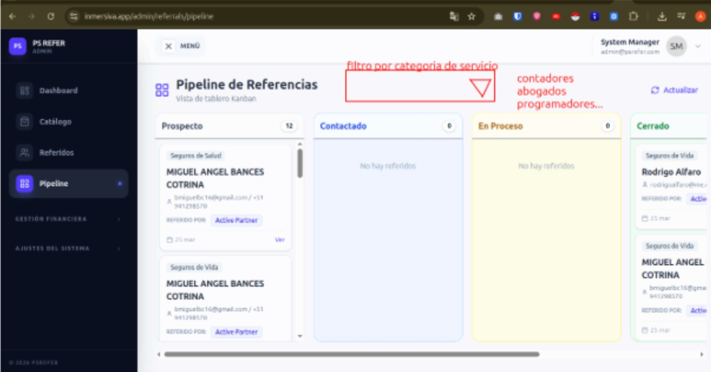

# 📋 Tareas Pendientes y Nuevos Requerimientos

Este documento detalla los problemas técnicos por resolver y los nuevos ajustes solicitados por el cliente según la última reunión.

## 🔴 Problemas Técnicos Críticos

### 📽️ Configuración de Correo (SMTP)
- **Estado**: BLOQUEADO (Error 535)
- **Detalle**: A pesar de que la carga dinámica está implementada y corregida para trabajar con colas, el servidor SMTP `mail.comidayago.com` sigue rechazando las credenciales (`test@comidayago.com`). 
- **Acción**: Es necesario verificar la contraseña con el proveedor o intentar un reinicio total del entorno local si existe un bloqueo de base de datos.

---

## 🆕 Requerimientos del Cliente (Segunda Etapa)

Basado en el video explicativo y el documento de cambios:

### 💼 Categorías de Asociados
Incluir o revisar las siguientes categorías:
- Realtor
- Contador
- Agente de Seguros

### 💰 Ajustes en Comisiones
- **Nuevas Etiquetas**: El sistema debe soportar la etiqueta **"Varía depende del servicio"** para casos donde el monto se determine según la cotización final del cliente.
- **Simplificación**: 
    - Se eliminan los **pagos recurrentes mensuales**.
    - Las comisiones se limitan a: **Porcentaje fijo** o **Monto fijo**.

### 📸 Referencias Visuales

#### Imagen de Cambios

#### Video Explicativo Completo
Para entender el flujo detallado de estos cambios, consultar el video:
[Ver Video de Explicación](CambiosVideo.mp4)

---
*Última actualización: 28 de Marzo, 2026*
